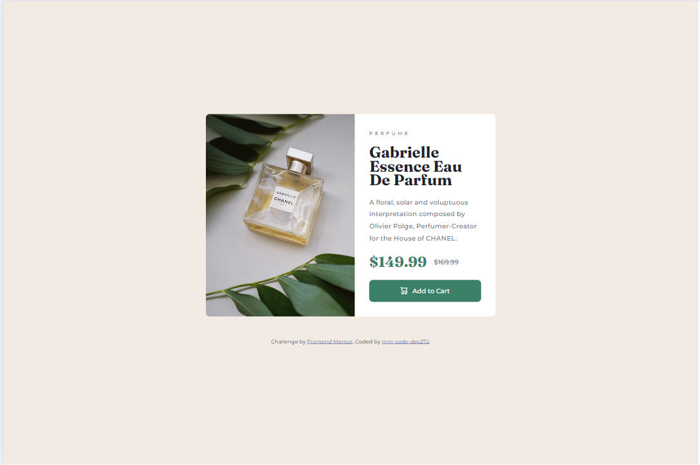
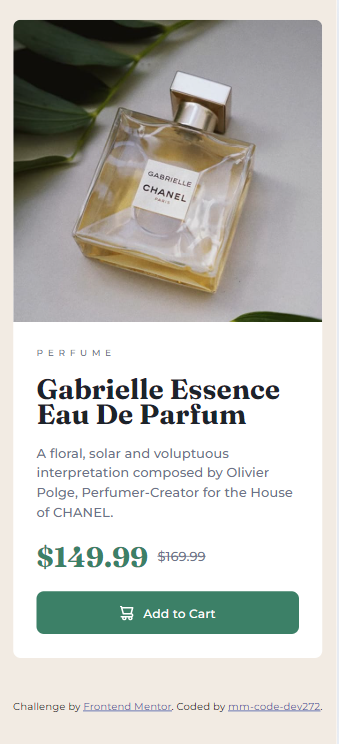
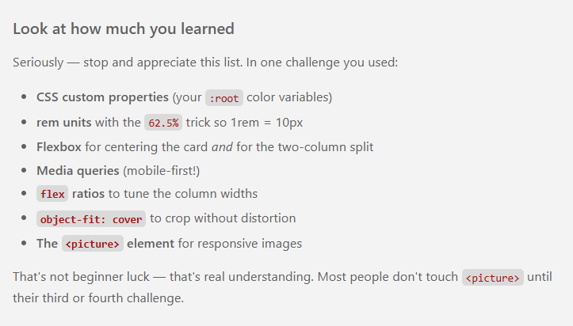

<h1 align="center">Frontend Mentor - Product preview card component solution</h1>

This is a solution to the [Product preview card component challenge on Frontend Mentor](https://www.frontendmentor.io/challenges/product-preview-card-component-GO7UmttRfa). Frontend Mentor challenges help you improve your coding skills by building realistic projects. 

## Table of contents

- [Overview](#overview)
  - [The challenge](#the-challenge)
  - [Screenshot](#screenshot)
  - [Links](#links)
- [My process](#my-process)
  - [Built with](#built-with)
  - [What I learned](#what-i-learned)
  - [AI Collaboration](#ai-collaboration)
- [Author](#author)

## Overview

### The challenge

Users should be able to:

- View the optimal layout depending on their device's screen size
- See hover and focus states for interactive elements

### Screenshot

### Links

- Live Site URL : [Demo](https://mm-code-dev272.github.io/My-frontend-mentor-challenges/06-product-preview-card/product-preview-card.html)

## My process

### Built with

- Semantic HTML5 markup
- CSS custom properties
- Flexbox
- Mobile-first workflow

### What I learned

I really proud of this result. It is my Agent response.

### AI Collaboration

I used Atria Dawn Preview Agent using AGENTS.md file in the starter folder.

## Author

- LinkedIn - [Mohammadreza Mohammadi](https://www.linkedin.com/in/mohammadreza-mohammadi-b16864441/?lipi=urn%3Ali%3Apage%3Ad_flagship3_profile_view_base_contact_details%3Bkvq2sKVHT5y1JXxzPjlz%2FQ%3D%3D)
